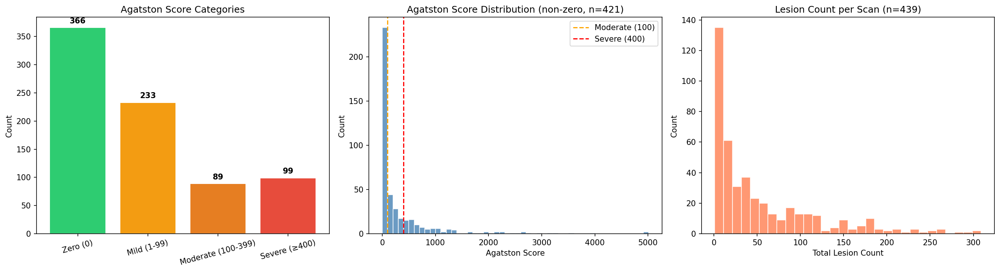
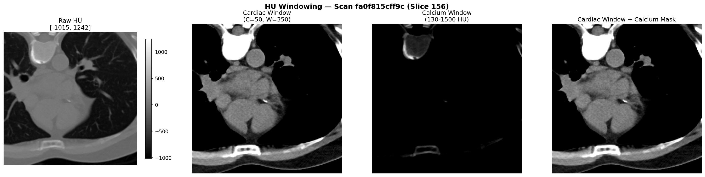
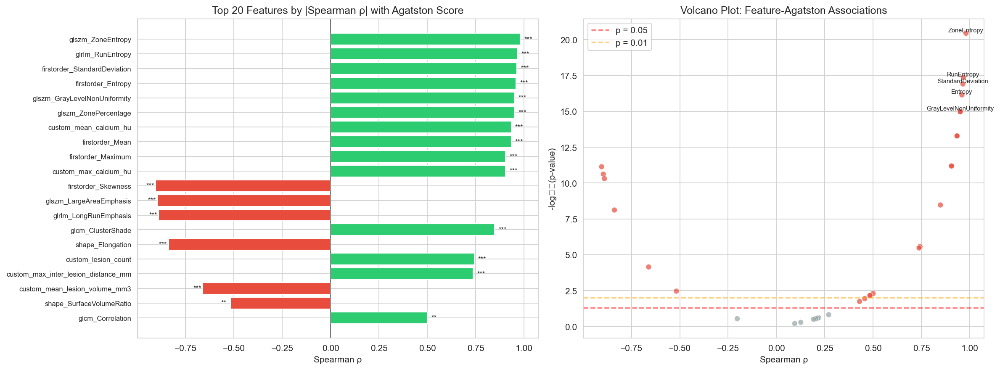
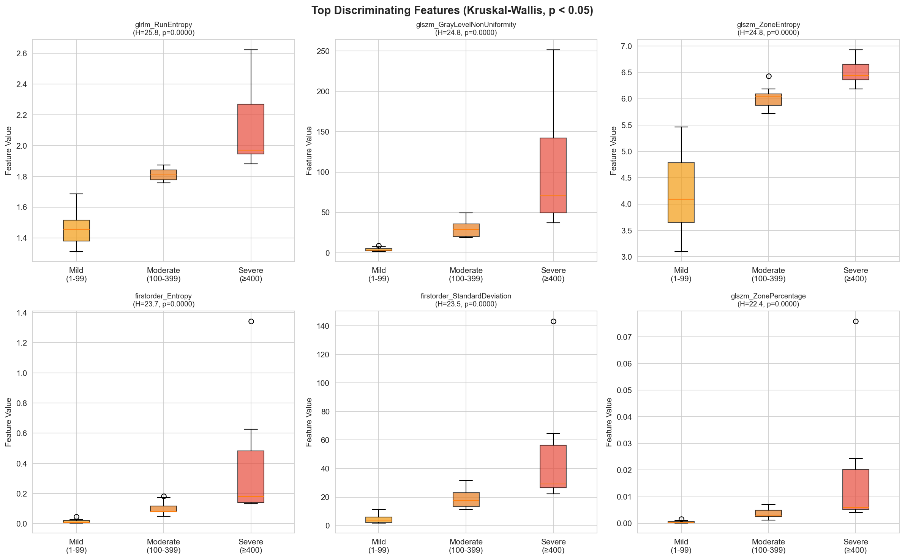
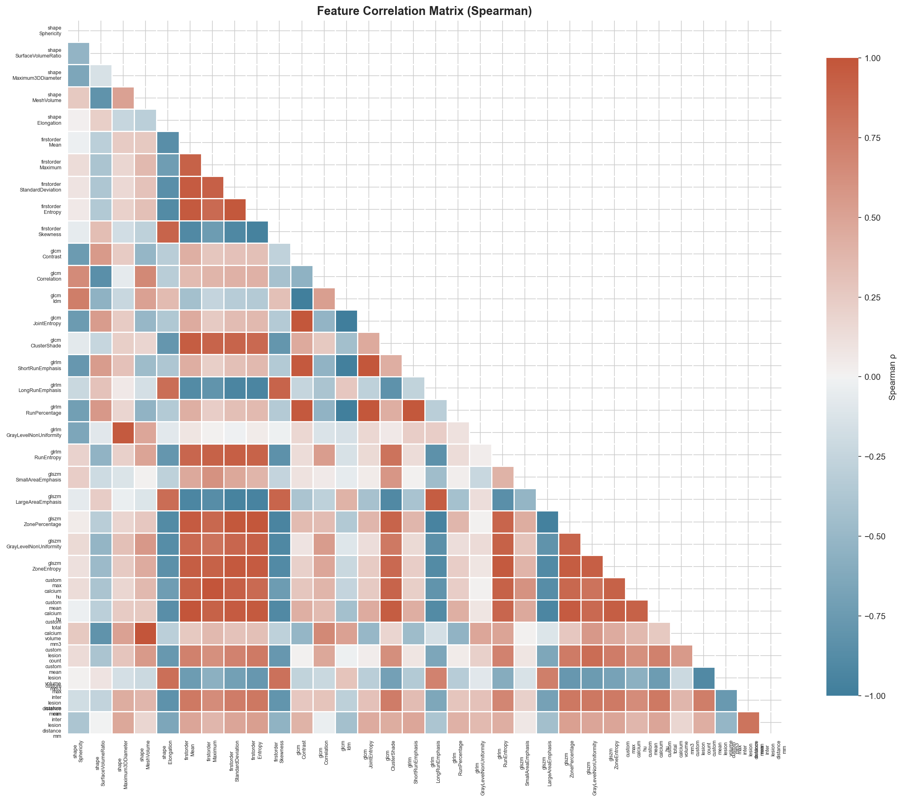
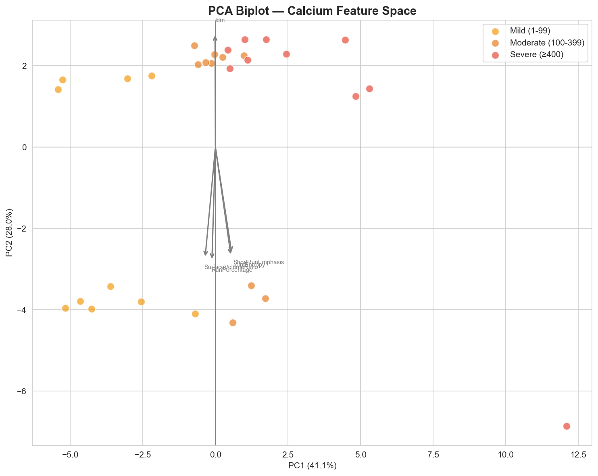
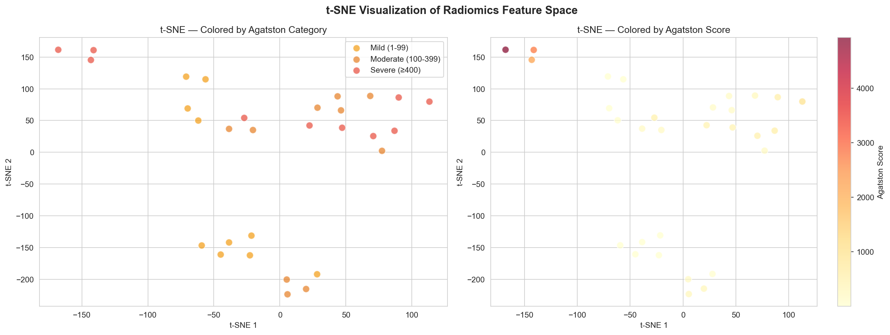
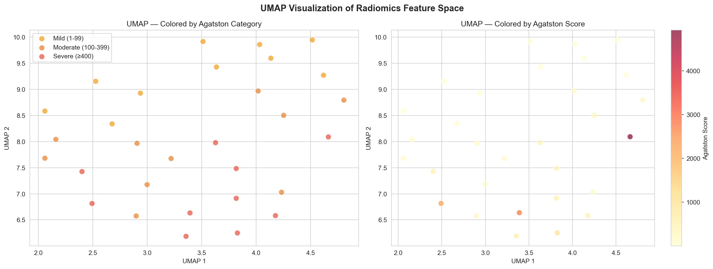
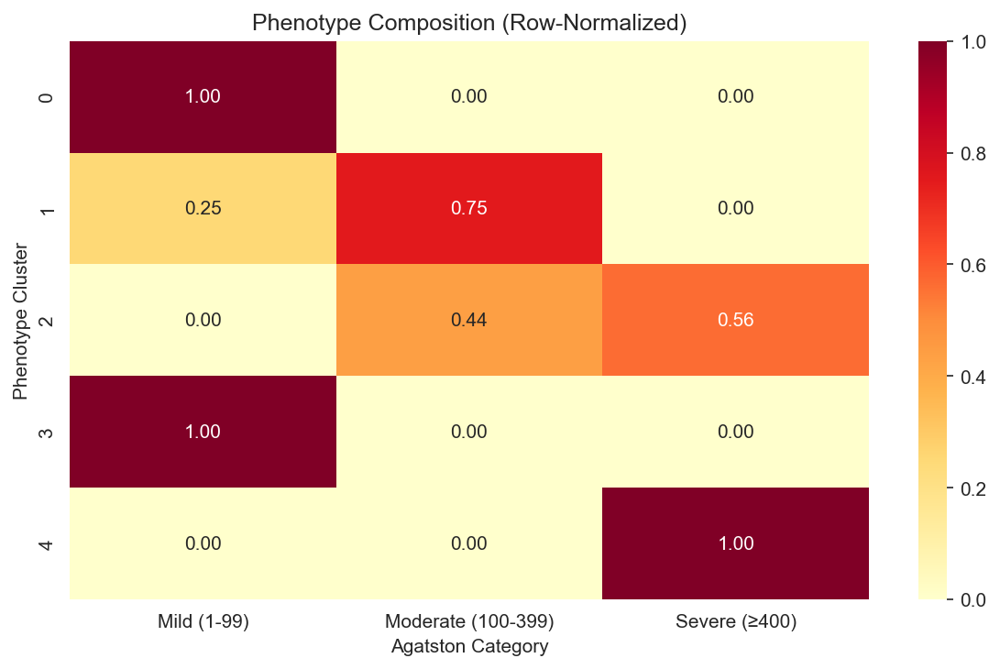
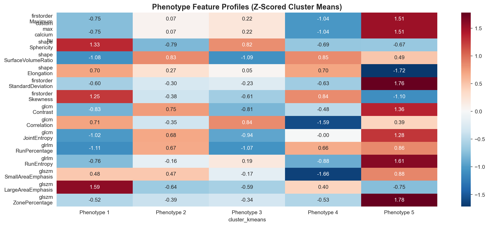

# PrediCT GSoC 2026 — Evaluation Task
## Project 2: Radiomics Feature Extraction & Calcium Phenotype Discovery

**Applicant:** Shreyas Chitransh  
**Contact:** shreyaschit15@gmail.com
**Linkedin:** https://www.linkedin.com/in/shreyaschitransh/
**Gitter Username:** @shreyaschitransh:gitter.im

---

### Overview

This repo contains my evaluation task submission for the PrediCT project under Google Summer of Code 2026. The work is split into two notebooks:

1. **Common Task** — COCA dataset preprocessing, Agatston scoring, stratified splitting, and a PyTorch dataloader tailored for radiomics
2. **Specific Task (Project 2)** — PyRadiomics feature extraction from 30 calcium-positive scans, statistical analysis (Spearman, Kruskal-Wallis), PCA, t-SNE/UMAP visualization, and unsupervised clustering for phenotype discovery

Both notebooks run end-to-end and reproduce all results and figures shown below.

---

### Repository Structure

```
PrediCT-GSoC-Eval/
├── coca_project/                  # COCA dataset (gitignored, ~20GB)
│   ├── data_resampled/            # 0.7mm isotropic NIfTI volumes
│   ├── data_canonical/            # scan index, metadata JSONs
│   └── data_raw/                  # original DICOMs
├── notebooks/
│   ├── 01_common_task_preprocessing.ipynb
│   └── 02_specific_task_radiomics.ipynb
├── results/
│   ├── common_task/               # registry CSVs, preprocessing plots
│   └── specific_task_radiomics/   # feature CSVs, analysis plots, YAML config
├── requirements.txt
└── README.md
```

### Setup

```bash
uv venv .venv --python 3.12
source .venv/bin/activate
uv pip install -r requirements.txt
# Download COCA dataset following https://github.com/KatyEB/PrediCT/tree/GSoC
# Run unsetter.py and pipeline.py to get resampled NIfTI files
```

**requirements.txt:**
```
numpy
pandas
matplotlib
seaborn
nibabel
pydicom
SimpleITK
scikit-learn
scipy
torch
pyradiomics
pyyaml
umap-learn
```

---

## Common Task: COCA Dataset Preprocessing

### What I Did

- Scanned the resampled COCA directory and built a registry of 787 valid scans (image + segmentation NIfTI pairs)
- Implemented two HU windows: cardiac soft-tissue (C=50, W=350) for anatomical context and calcium-specific (130–1500 HU) for isolation. Windowing is applied on-the-fly in the dataloader to keep raw HU intact for Agatston scoring and radiomics
- Computed Agatston scores using the standard density-weighted area method with a thickness correction factor (`slice_thickness / 3.0`) since the resampled data is 0.7mm thick vs the 3mm slices Agatston was originally designed for
- Stratified 70/15/15 train/val/test split using Agatston category as the stratification variable
- Built a PyTorch `Dataset`/`DataLoader` with weighted random sampling to handle class imbalance and conservative augmentation (flips, ±5° rotation, σ=0.01 noise)

### Dataset Statistics

| Metric | Value |
|--------|-------|
| Total valid scans | 787 |
| With calcium | 447 (56.8%) |
| Without calcium | 340 (43.2%) |
| Agatston Zero | 366 |
| Agatston Mild (1-99) | 233 |
| Agatston Moderate (100-399) | 89 |
| Agatston Severe (≥400) | 99 |

| Split | Total | Zero | Mild | Moderate | Severe |
|-------|-------|------|------|----------|--------|
| Train (70%) | 550 | 256 | 163 | 62 | 69 |
| Val (15%) | 118 | 55 | 35 | 13 | 15 |
| Test (15%) | 119 | 55 | 35 | 14 | 15 |

### Key Plots

**Agatston Score Distribution**  
Heavy right-skew with most non-zero scores below 200. The Moderate and Severe cutoffs at 100 and 400 are marked.



**HU Windowing Demo**  
Raw HU (full dynamic range) → cardiac window (soft tissue detail) → calcium window (bright deposits only) → overlay with segmentation mask.



**Stratified Split**  
Category proportions are preserved across all three splits — this matters because the downstream radiomics analysis stratifies by these groups.


---

## Specific Task: Radiomics Feature Extraction & Phenotype Discovery

### What I Did

Selected 30 calcium-positive scans (10 Mild, 10 Moderate, 10 Severe) and extracted 32 radiomics features:
- **25 PyRadiomics features** across 5 classes: Shape (5), First-order (5), GLCM (5), GLSZM (5), GLRLM (5)
- **7 custom features**: max/mean calcium HU, total calcium volume, lesion count, mean lesion volume, max/mean inter-lesion distance

The 12 features required by the task spec (Sphericity, SurfaceVolumeRatio, Maximum3DDiameter, Contrast, Correlation, Idm, SmallAreaEmphasis, LargeAreaEmphasis, ZonePercentage, ShortRunEmphasis, LongRunEmphasis, RunPercentage) are all included. I added 2 extra per class because the downstream PCA/clustering needs enough dimensionality to find meaningful structure — you can't do much with 12 features on 30 samples. Each addition has a specific reason:

| Extra Feature | Why |
|---------------|-----|
| MeshVolume | Can't phenotype calcium without actual volume |
| Elongation | Distinguishes elongated vs. compact deposits |
| Mean, Maximum, StdDev, Entropy, Skewness | Intensity statistics needed for the optional HU analysis |
| JointEntropy, ClusterShade | Texture complexity and asymmetry |
| GrayLevelNonUniformity (GLSZM + GLRLM) | Heterogeneity — key discriminator between diffuse vs. focal calcium |
| ZoneEntropy, RunEntropy | Information-theoretic texture measures |

The custom spatial features (lesion count, inter-lesion distances) are not available in PyRadiomics and are relevant for distinguishing spotty vs. diffuse calcium patterns mentioned in the project description.

### Why Zero-Score Scans Are Excluded

Zero-Agatston scans have empty calcium masks. PyRadiomics needs a non-empty ROI to compute shape, texture, and intensity features — there's literally nothing to measure. These scans are still present in the common task registry and serve as a reference category for Agatston stratification, but you can't extract radiomics from an empty mask.

### Key Results

**Spearman Correlation with Agatston Score**

| Feature | ρ | p-value |
|---------|---|---------|
| glszm_ZoneEntropy | 0.980 | 3.6e-21 |
| glrlm_RunEntropy | 0.967 | 4.2e-18 |
| firstorder_StandardDeviation | 0.964 | 1.2e-17 |
| firstorder_Entropy | 0.959 | 7.1e-17 |
| glszm_GrayLevelNonUniformity | 0.950 | 7.1e-16 |
| firstorder_Skewness | -0.756 | 1.2e-06 |
| glszm_LargeAreaEmphasis | -0.730 | 4.5e-06 |
| glrlm_LongRunEmphasis | -0.726 | 5.3e-06 |

Texture entropy features (ZoneEntropy, RunEntropy) correlate almost as strongly as volume-based measures — this is interesting because it suggests texture captures calcium burden through a different morphological lens, not just "more calcium = higher value."

Negative correlations make clinical sense: higher Skewness means the HU distribution is more right-tailed (fewer high-intensity voxels, typical of mild deposits), LargeAreaEmphasis decreases because severe cases have more fragmented zone structure.



**Kruskal-Wallis Across Agatston Categories**

All top features significant at p < 0.0001 with clear monotonic separation in boxplots (Mild → Moderate → Severe). Minimal overlap between groups for the best discriminators.



**Correlation Matrix**

Block structure is visible — shape features correlate within their group, texture classes (GLRLM ↔ GLSZM) are correlated. The custom inter-lesion distance features form their own block (bottom-right). This redundancy justifies using PCA.



**PCA**

PC1 captures 41.1% of variance (calcium burden axis), PC2 captures 28.0% (shape/texture variation orthogonal to burden). 90% variance at 5 components, 95% at 7 — good compression from 32 features.

The biplot shows a clear Mild → Severe gradient along PC1, with the extreme outlier (Agatston ~4930) far right. Loading arrows point to Idm (upward, PC2-dominant), SurfaceVolumeRatio and RunPercentage (downward) — these capture shape and texture independently of burden level.



**t-SNE and UMAP**

t-SNE (perplexity=5, adjusted for small n) shows three rough groups: mild cases clustered at bottom, moderate in the middle band, severe scattered across the top and right. UMAP shows a more continuous left-to-right gradient from mild → severe.




**Clustering — 5 Discovered Phenotypes**

K=5 selected by silhouette score (0.378). The phenotype-Agatston crosstab is the interesting part:

| Phenotype | Composition | Interpretation |
|-----------|-------------|----------------|
| 1 | 100% Mild | Low-burden, compact deposits |
| 4 | 100% Mild | Low-burden (different texture profile) |
| 2 | 75% Moderate + 25% Mild | Transitional, growing burden |
| 3 | 44% Moderate + 56% Severe | Transitional, approaching severe |
| 5 | 100% Severe | High-burden, heterogeneous calcium |

The fact that the unsupervised clusters align with but are not identical to Agatston categories is exactly what you'd want — it means the radiomics features capture morphological patterns beyond just calcium amount.



**Phenotype Feature Profiles**

Z-scored cluster means show how each phenotype differs. Phenotype 5 (severe) is elevated in StandardDeviation, RunEntropy, ZonePercentage, Contrast — dense, heterogeneous, complex calcium. Phenotype 1 (mild) shows elevated Sphericity, Skewness, LargeAreaEmphasis — smaller, more uniform deposits with right-skewed HU distribution.



---

## Challenges & Tradeoffs

### Agatston Scoring on Resampled Data

The COCA pipeline resamples everything to 0.7mm isotropic. Agatston scoring was designed for 3mm slices — directly applying it to thin slices overcounts because each calcium lesion contributes to many more slices. I multiply per-slice scores by `slice_thickness / 3.0` as a correction factor. This gives reasonable score distributions but the absolute values won't perfectly match clinical scanners. For our purposes (relative ranking and category assignment) this is fine.

### Augmentation vs. Radiomics Compatibility

This was the main tradeoff. Aggressive augmentation (elastic deformations, large rotations, intensity shifts) would destroy the texture statistics we're trying to extract — GLCM and GLRLM features are computed on the raw voxel grid and are sensitive to interpolation artifacts. I kept it minimal: horizontal flips, ±5° rotation, and tiny Gaussian noise (σ=0.01). Augmentation is **only** used during model training and is **never** applied during radiomics feature extraction.

### Feature Count: 12 vs. 32

The task spec lists 12 required features. I added 20 more, not to pad the submission but because PCA and clustering on 12 features from 30 samples is statistically shaky — the feature-to-sample ratio matters. Each extra feature has a specific justification (see table above). I deliberately avoided going to 50+ features, which would have been easy with PyRadiomics' full extraction but hard to justify for 30 samples.

### Cluster Count: K=5 on 30 Samples

Silhouette score peaks at K=5 (0.378), Calinski-Harabasz at K=7. I went with silhouette because K=7 gives ~4 samples per cluster which is too few to characterize meaningfully. K=5 gives ~6 per cluster — still small, but enough to see distinct patterns in the phenotype heatmap. With more scans (the full project targets 50-100), this would tighten up.

### Class Imbalance

Zero-calcium scans make up 43% of the dataset. Without correction, a model would learn to predict "no calcium" and be right almost half the time. I used inverse-frequency weighted sampling for the training dataloader — rarer categories (Moderate, Severe) get sampled more often. Val/test stay unweighted to reflect real-world distribution.

---

## Deliverables Checklist

| Requirement | Status | Location |
|---|---|---|
| Pipeline code | ✅ | `notebooks/01_common_task_preprocessing.ipynb` |
| Data loader | ✅ | `COCARadiomicsDataset` class in notebook 01 |
| Written justification | ✅ | Markdown cells in notebook 01 + this README |
| Dataset statistics | ✅ | Plots + tables in notebook 01 |
| Feature extraction code | ✅ | `notebooks/02_specific_task_radiomics.ipynb` |
| CSV with features | ✅ | `results/specific_task_radiomics/radiomics_features.csv` |
| Spearman correlation + p-values | ✅ | `results/specific_task_radiomics/spearman_correlation.csv` |
| Kruskal-Wallis + p-values | ✅ | `results/specific_task_radiomics/kruskal_wallis.csv` |
| Correlation matrix | ✅ | `results/specific_task_radiomics/correlation_matrix.png` |
| Significant associations (p<0.05) | ✅ | Multiple features at p < 0.0001 |
| Visualizations | ✅ | 16 plots across both notebooks |
| *Optional:* t-SNE/UMAP | ✅ | Both implemented |
| *Optional:* Unsupervised clustering | ✅ | K-Means (K=5) + hierarchical dendrogram |
| *Optional:* Phenotype characterization | ✅ | Crosstab + z-scored profiles |

---
