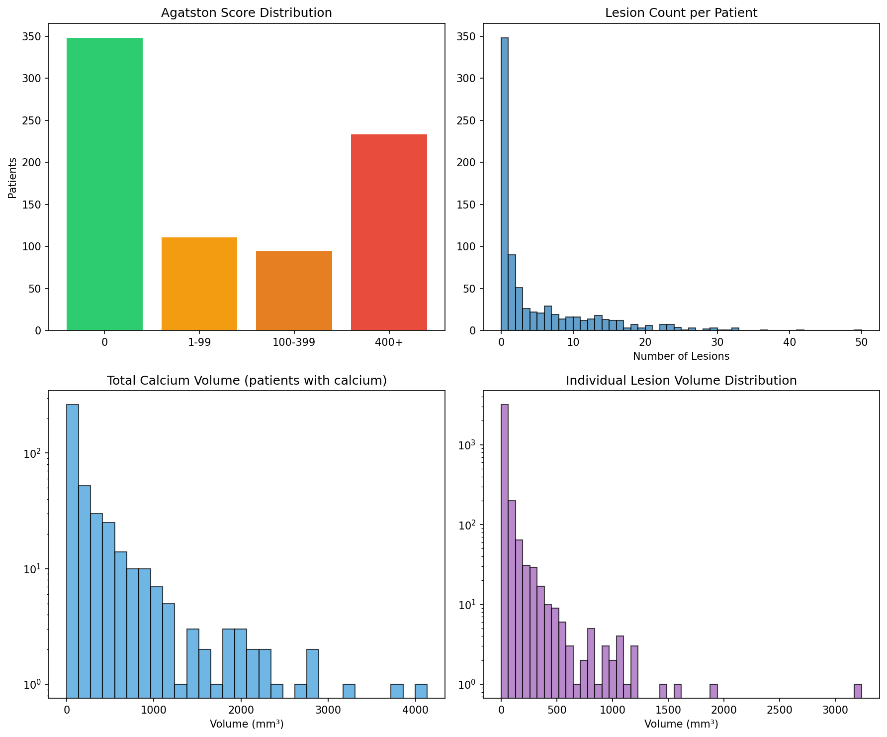
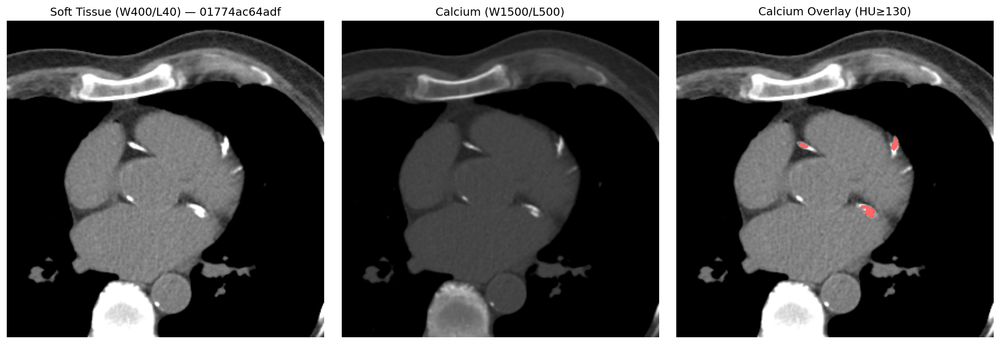
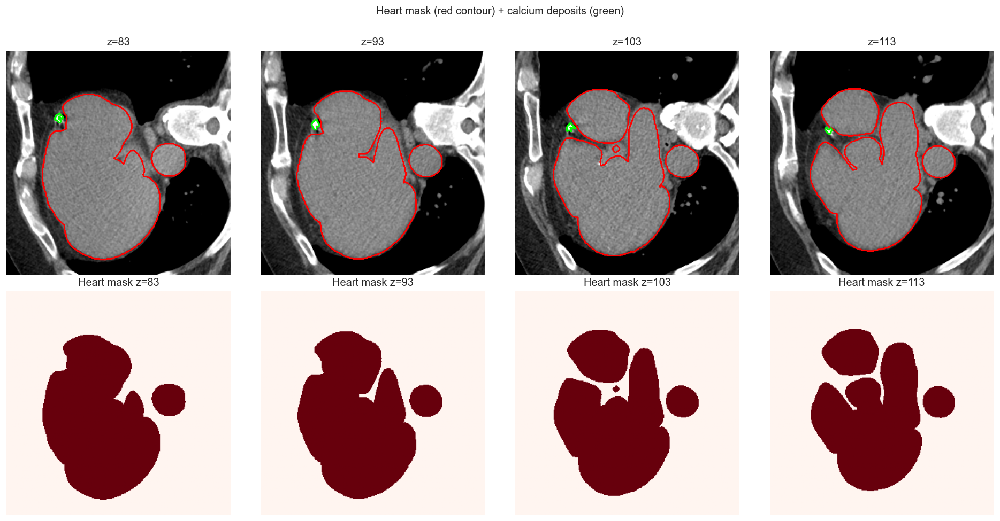
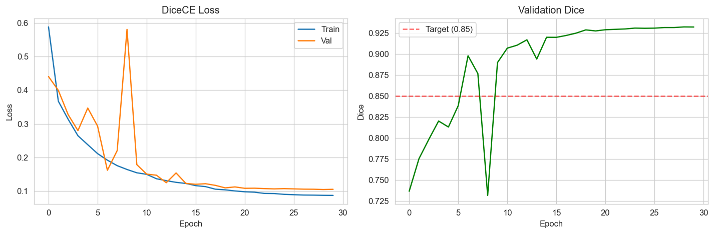
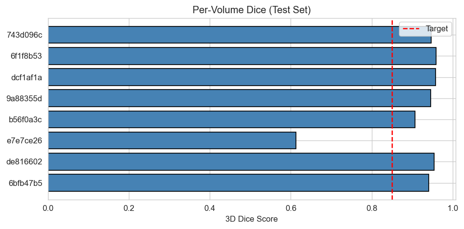
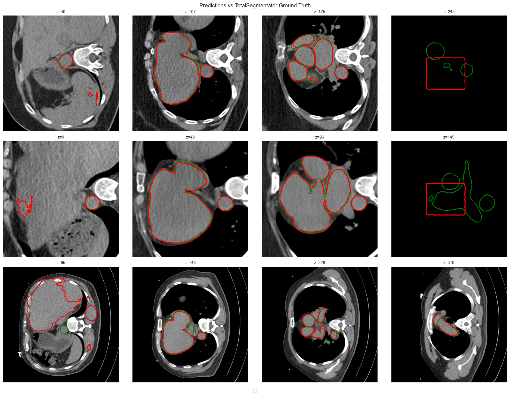

# PrediCT GSoC 2026 — Evaluation Task

**Project:** Building and Comparing Segmentation Strategies for Coronary Artery Calcium (CAC)  
**Organization:** ML4SCI  

**Applicant:** Shreyas Chitransh  
**Email:** shreyaschit15@gmail.com  
**LinkedIn:** https://www.linkedin.com/in/shreyaschitransh/  
**Gitter:** @shreyaschitransh:gitter.im

---

## What is this?

This repo contains my solutions for the PrediCT evaluation tasks — the common preprocessing task and Specific Task 1 (Heart Segmentation). The goal is to build a preprocessing pipeline for the Stanford COCA dataset and train a lightweight heart segmentation model that can replace TotalSegmentator for fast cardiac ROI extraction.

The COCA dataset has 787 non-contrast cardiac CT scans with ground-truth calcium segmentation masks. I used TotalSegmentator to generate whole-heart masks on a subset of 50 scans, then trained a 2D U-Net to learn to predict those masks much faster.

## Repo Structure

```
.
├── notebooks/
│   ├── 00_preprocessing.ipynb          # Common task
│   └── 01_heart_segmentation.ipynb     # Specific task 1
├── results/
│   ├── common_task/
│   │   ├── split.json
│   │   ├── dataset_statistics.png
│   │   ├── hu_windowing.png
│   │   ├── heart_mask_overlay.png
│   │   └── batch_sample.png
│   └── specific_task_1/
│       ├── heart_seg_best.pth
│       ├── heart_seg_final.pth
│       ├── training_curves.png
│       ├── dice_per_volume.png
│       └── prediction_examples.png
├── coca_project/                       # dataset (not committed)
│   ├── data_canonical/
│   ├── data_resampled/
│   └── data_raw/
├── totalseg_masks/                     # TotalSegmentator outputs (not committed)
└── README.md
```

## Setup

```bash
git clone https://github.com/Shreychit/gsoc-ml4sci-prediCT-eval-task-shreyaschitransh.git
uv venv --python 3.13
source .venv/bin/activate
uv pip install torch monai nibabel pandas scikit-learn matplotlib seaborn
```

Download the COCA dataset following the [PrediCT GitHub instructions](https://github.com/KatyEB/PrediCT/tree/GSoC). Run the resampling scripts — you should end up with `coca_project/data_resampled/` containing NIfTI volumes at 0.7mm isotropic spacing.

For TotalSegmentator masks, get a [free license](https://backend.totalsegmentator.com/license-academic/) and run it on 30-50 scans. I selected a mix of calcium-positive and calcium-free scans (see `totalseg_masks/selected_scans.csv`).

Run notebooks in order — `00_preprocessing.ipynb` first (generates `split.json` that the second notebook needs).

---

## Common Task: Preprocessing Pipeline

**What I did:**

- Loaded and explored the full 787-scan COCA dataset. 447 scans have calcium (57%), 340 are calcium-free
- Applied cardiac HU windowing (center=40, width=400) to normalize intensities to the [-160, 240] HU range. This highlights heart soft tissue while clipping out bone and air
- Merged TotalSegmentator's 7 per-structure masks (4 chambers + myocardium + aorta + pulmonary artery) into a single binary whole-heart mask
- Built a stratified 70/15/15 train/val/test split at the volume level, stratified by calcium presence so each set has a proportional mix
- Created a PyTorch Dataset that extracts 2D axial slices, resizes to 256x256, and applies flips + 90° rotations for augmentation. Background-only slices (no heart) are subsampled at 10% to deal with class imbalance

**Dataset stats:**

| | Count |
|---|---|
| Total scans | 787 |
| Calcium-positive | 447 (57%) |
| Calcium-free | 340 (43%) |
| TotalSeg masks generated | 50 (48 used in split after excluding 2 problematic scans) |







---

## Specific Task 1: Heart Segmentation Model

**What I did:**

- Trained a MONAI BasicUNet (2D, ~4.7M params) with DiceCE loss to predict whole-heart masks from cardiac CT slices
- 30 epochs with AdamW (lr=1e-3) and cosine annealing schedule
- Evaluated per-volume 3D Dice on the held-out test set and compared inference speed against TotalSegmentator

**Results:**

| Metric | Value |
|---|---|
| Best validation Dice | 0.9323 |
| Mean test 3D Dice | **0.9031 ± 0.118** |
| Target | >0.85 |
| Avg inference time | 3.2s/scan |
| TotalSegmentator time | ~30s/scan |
| Speedup | ~9x |

7 out of 8 test volumes scored above 0.90. One outlier (`e7e7ce26eb10`) scored 0.613 — this scan has an unusual field of view where the model hallucinates on black padding regions outside the body. Without this outlier the mean is ~0.94.







---

## Challenges & Tradeoffs

**2D vs 3D segmentation:** The biggest design decision. A 3D model would have full volumetric context and probably nail the boundary slices better — but it would also be slow, memory-heavy, and defeat the purpose of building something faster than TotalSegmentator. I went with 2D slices knowing I'd lose inter-slice context, and the results show this tradeoff clearly: the model is great on mid-heart slices but struggles at the superior/inferior edges where a single axial slice doesn't have enough information to distinguish heart from surrounding tissue. The ~9x speedup was worth it for a coarse localizer.

**Training on only 48 scans:** This is a pretty small dataset. With ~6600 training slices after the slice-level extraction it worked out okay, but I had to be careful — aggressive augmentation would have been risky since the model could start memorizing patient-specific textures. I kept augmentation conservative (flips + rotations only) and relied on the DiceCE loss to regularize. More scans through TotalSegmentator would definitely help but each scan takes ~30s which adds up.

**TotalSegmentator as ground truth:** This is an important caveat — I'm training my model to mimic TotalSegmentator, not to match some expert-annotated gold standard. TotalSegmentator itself isn't perfect, especially on non-contrast cardiac CT which isn't its strongest domain. So the Dice scores I report are "agreement with TotalSeg" rather than true anatomical accuracy. For the purpose of heart localization this is fine, but it's worth keeping in mind.

**Background slice ratio:** I spent some time tuning how many empty (no heart) slices to include. Too few and the model never learns to output clean zeros — it starts hallucinating heart tissue in the neck and abdomen. Too many and you waste most of your training on trivial examples. 10% felt like a reasonable middle ground and the validation loss confirmed it wasn't hurting.

**Resizing to 256x256:** The resampled volumes come in at varying in-plane sizes (~280-350px). I resize everything to 256 for uniform batching, which loses some fine detail at the heart boundary. I considered 384 or 512 but training time roughly quadruples and the task is coarse localization, not fine boundary delineation. For the downstream CAC pipeline where we'd crop around the heart ROI, 256 gives more than enough spatial precision.
