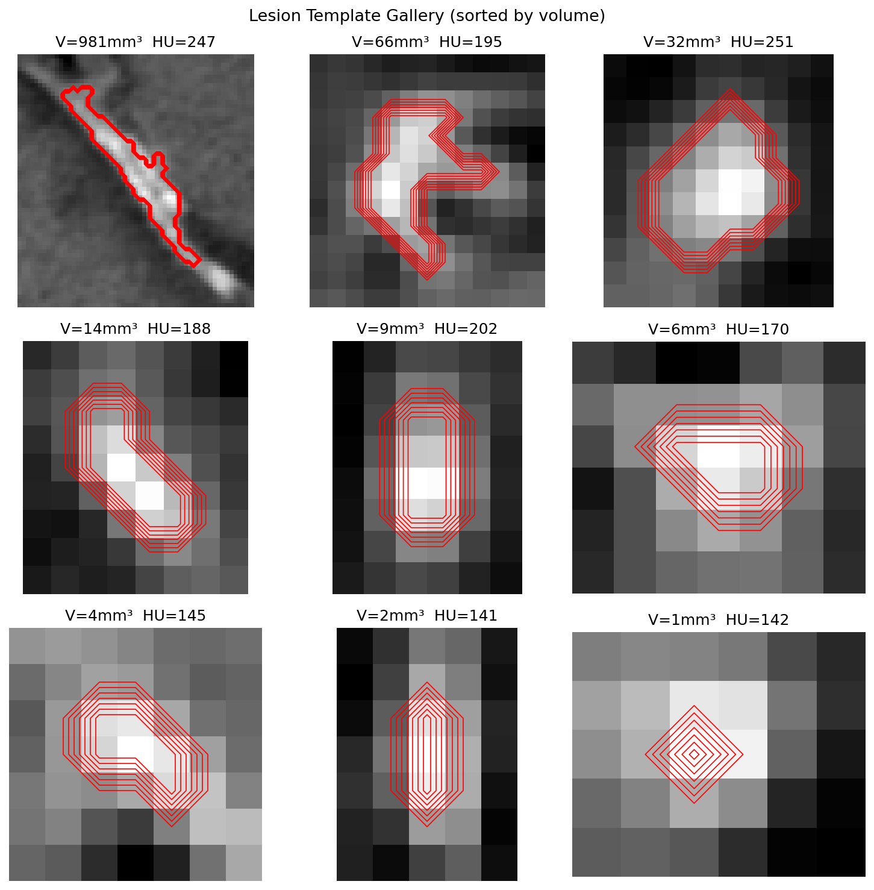
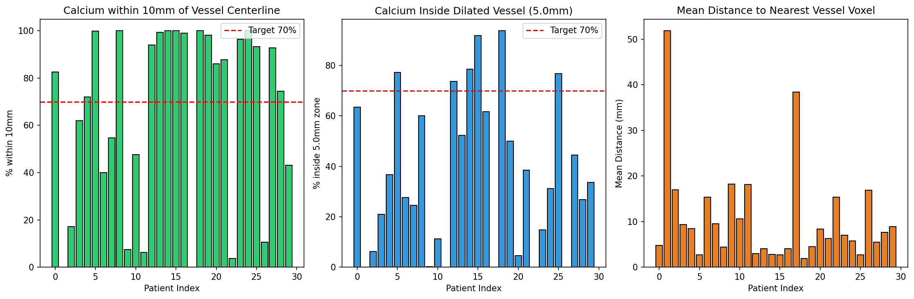
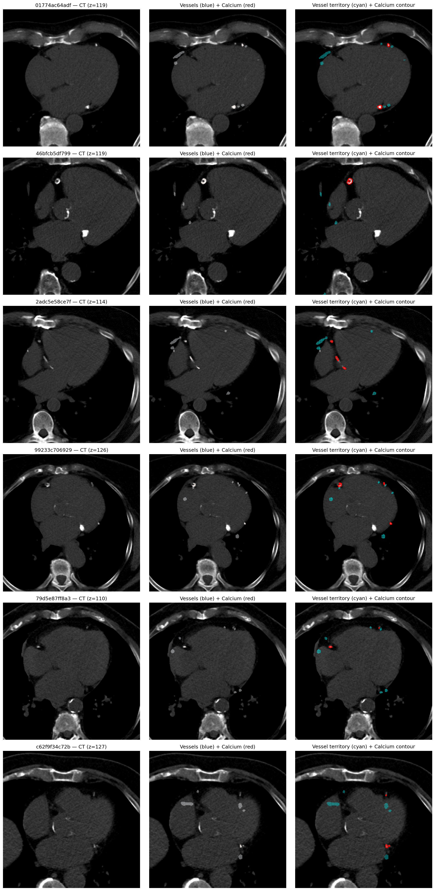

# PrediCT GSoC 2026 — Evaluation Task Submission

**Project:** Data Augmentation Using Physics-Informed Plaque Growth Simulation

**Applicant:** Shreyas Chitransh
- Email: shreyaschit15@gmail.com
- LinkedIn: [shreyaschitransh](https://www.linkedin.com/in/shreyaschitransh/)
- Gitter: @shreyaschitransh:gitter.im

---

## What this repo contains

This repo has my completed evaluation tasks for the PrediCT project under ML4SCI (GSoC 2026). I worked on the **Common Task** (COCA dataset preprocessing, tailored for Project 3) and **Specific Task 3** (coronary atlas registration).

The core idea behind Project 3 is building a physics-informed simulation pipeline that generates synthetic calcium plaques in cardiac CT scans. To do that you need two things: a library of real calcium lesion shapes to use as templates, and a way to map coronary vessel territories onto patient scans so you know *where* to place the synthetic calcium. The common task builds the first part, and the specific task tackles the second.

## Repo structure

```
.
├── notebooks/
│   ├── 00_common_preprocessing.ipynb    # Common task
│   └── 01_atlas_registration.ipynb      # Specific task 3
├── results/
│   ├── common_task/
│   │   ├── split.json
│   │   ├── hu_windowing.png
│   │   ├── dataset_statistics.png
│   │   ├── lesion_templates_stats.png
│   │   ├── lesion_template_gallery.png
│   │   └── batch_sample.png
│   └── specific_task_3/
│       ├── registration_results.csv
│       ├── registration_timing.png
│       ├── validation_metrics.csv
│       ├── calcium_validation.png
│       └── visual_overlays.png
├── coca_project/                        # COCA dataset (not tracked)
│   ├── data_canonical/
│   ├── data_raw/
│   └── data_resampled/
├── imagecas/                            # ImageCAS atlas (not tracked)
│   ├── img/
│   └── label/
├── totalseg_masks/                      # TotalSegmentator outputs (not tracked)
└── README.md
```

## Setup

```bash
git clone https://github.com/Shreychit/gsoc-ml4sci-prediCT-eval-task-shreyaschitransh.git
cd gsoc-ml4sci-prediCT-eval-task-shreyaschitransh
python -m venv .venv
source .venv/bin/activate
pip install numpy SimpleITK matplotlib scipy torch scikit-learn scikit-image pandas
```

**Data:**
1. Follow [PrediCT GitHub](https://github.com/KatyEB/PrediCT/tree/GSoC) instructions to download and resample the Stanford COCA dataset
2. Run TotalSegmentator on the resampled scans to get heart masks
3. Download 1-2 cases from [ImageCAS on Kaggle](https://www.kaggle.com/datasets/xiaoweixumedicalai/imagecas/data) — you only need one image+label pair for the atlas. Put them in `imagecas/img/` and `imagecas/label/`

Run `00_common_preprocessing.ipynb` first since the registration notebook reads the `split.json` it generates.

## Common Task: COCA Preprocessing

Built a preprocessing pipeline for the COCA dataset, specifically oriented toward extracting calcium lesion templates for the simulation project.

**What I did:**
- Wrote a patient discovery function that auto-detects which NIfTI file is the image vs the mask (the COCA dataset doesn't have a consistent naming convention so I had to handle that)
- Two HU windows: soft tissue (W400/L40) for anatomical context during registration, and a calcium-specific window (W1500/L500) for lesion delineation
- Agatston score computation using the standard density weighting scheme. Used this to stratify the 70/15/15 split so each fold has proportional representation of zero, low, moderate, and high calcium burden
- Augmentation is deliberately minimal — just small rotations (±5°), translations, and Gaussian noise. I avoided elastic deformations because they'd warp the lesion shapes that we need to faithfully extract as templates
- The key deliverable for Project 3: a lesion template extractor that pulls out each connected calcium component as a 3D patch with its binary mask, HU intensities, volume, and bounding box. Extracted 258 templates from the first 50 train patients

**Key findings:**
- 787 patients total, 348 with zero calcium, 233 with Agatston 400+
- 3,568 individual lesions across the dataset, median volume 8.9 mm³
- Most lesions are tiny (< 50 mm³) but there's a long tail up to ~1000 mm³
- Mean HU of extracted templates ranges from 130 to 380, with most around 150-200




## Specific Task 3: Coronary Atlas Registration

Registered an ImageCAS CCTA coronary atlas to 30 COCA non-contrast scans using SimpleITK, then validated how well the warped vessel territories line up with actual calcium deposits.

**What I did:**
- Two-stage registration: rigid (6 DOF) then affine (12 DOF), both with Mattes Mutual Information
- Used center-of-mass initialization (MOMENTS) which worked better than geometry-based init for scans with very different FOVs
- Heart ROI masking using TotalSegmentator to restrict the metric computation to the cardiovascular region
- Pre-filtered patients to only include those with real calcium (HU ≥ 130 within the mask, at least 10 voxels) so the validation numbers are meaningful
- Validated by computing the distance from each calcium voxel to the nearest warped vessel voxel

**Key findings:**
- 30/30 registrations successful, mean time ~94 seconds per scan
- About 13/30 patients exceed the 70% target for calcium within 10mm of vessel territories
- Mean distance to nearest vessel voxel is 3-18mm for most patients
- Direct vessel overlap ranges from 0-26% depending on the patient




## Challenges and tradeoffs

**HU thresholding vs raw masks.** The COCA masks label broader anatomical regions, not just calcified voxels. I initially used them as-is and the template volumes were coming out at 50,000+ mm³ — way too large for coronary calcium. Had to intersect every mask with `HU >= 130` to isolate actual calcium. This added complexity throughout the pipeline because you need the raw HU array alongside the mask at every step (data loader, template extraction, validation), but the alternative was garbage data so there was no real choice.

**Conservative augmentation vs more training variety.** For a segmentation project I'd normally throw in elastic deformations, intensity jittering, random crops — the usual. But here the whole point is to extract faithful lesion morphologies as templates for the simulation pipeline. If you elastically warp a spotty calcification, you've changed its shape, which defeats the purpose. So I limited augmentation to small rigid transforms and additive noise. Less variety in the training set, but the templates stay clean.

**Affine vs deformable registration.** Deformable registration (B-spline) would definitely improve local vessel alignment, but it introduces the risk of folding transforms — where the deformation field folds over itself and destroys the topological relationship between vessel territories. Since the downstream goal is building LAD/LCX/RCA probability maps, I'd rather have a spatially consistent but imprecise vessel territory than one that's locally accurate but topologically broken. The results show this costs us on the 70% target (only ~13/30 patients meet it), but I think it's the right call for this use case.

**Center-of-mass vs geometry initialization.** SimpleITK offers both `GEOMETRY` and `MOMENTS` for initializing the rigid transform. I tried both — `GEOMETRY` centers the images based on their physical extents, while `MOMENTS` aligns centers of mass. `MOMENTS` worked noticeably better because the CCTA atlas and COCA scans have very different FOVs (the atlas captures more of the chest), so geometric centers don't correspond to the same anatomy. Small change in the code but it made a real difference in how many registrations converged.

**Single atlas selection.** Ideally you'd register multiple atlases and pick the best per patient, but with only one usable ImageCAS case I couldn't do that. The per-patient variance in the results (some patients at 95%+, others below 30%) is almost certainly driven by how similar each patient's heart anatomy is to that single atlas. This is the first thing I'd fix during the actual GSoC project — even 3-4 atlas cases with a selection metric would probably cut the failure rate in half.
